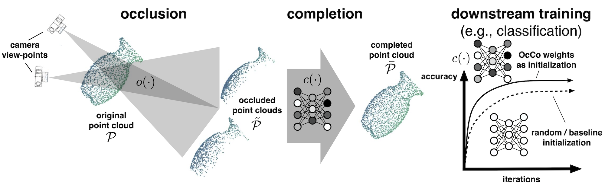

# Occlusion Completion

This is ALPhA's implementation of Occlusion Completion (OcCo). The original method is described in 

```
@inproceedings{OcCo,
	title = {Unsupervised Point Cloud Pre-Training via Occlusion Completion},
	author = {Hanchen Wang and Qi Liu and Xiangyu Yue and Joan Lasenby and Matthew J. Kusner},
	year = 2021,
	booktitle = {International Conference on Computer Vision, ICCV}
}
```

which can be found at https://arxiv.org/pdf/2010.01089.
The original GitHub repository can be found at https://github.com/hansen7/OcCo, of which this repository is a fork.

## Overview



Occlusion Completion is a method of pre-training that involves reconstructing a point cloud from an "occluded" point cloud, i.e. a point cloud with many of its points covered up. In essence, we are training a model to take in a partial point cloud and predict where the missing points are.

"Occlusion", in this case, is referring to covering up some of the points of a point cloud by pointing a camera at the point cloud and determining which points the camera cannot see. Since, theoretically, a perfect camera could see every point which is not exactly collinear with another, this involves some estimation. The method of occlusion we are currently using is described in https://www.weizmann.ac.il/math/ronen/sites/math.ronen/files/uploads/katz_tal_basri_-_direct_visibility_of_point_sets.pdf.

The model itself consists of an encoder and a decoder. The encoder takes in an occluded point cloud as input and converts it into a 1024-dimenstional vector. The decoder then takes that 1024-dimensional vector and converts it back into a point cloud, this time with many more points. This outputted point cloud is what the model believes the original point cloud was.

The hope is that this model learns useful properties of geometry and light that can be extended to other tasks. The encoder weights of this model can hopefully be used as initial weights in other models in order to speed up training or decrease the amount of data needed.

## Usage

The original code for Occlusion Completion consisted of two implementations: one in `PyTorch` and one in `TensorFlow`. The `TensorFlow` implementation has been tested and used for experiments; the `PyTorch` implementation has not. Use the `PyTorch` implementation at your own discretion.

To run the `TensorFlow` implementation which can be found in `OcCo_TF/`, take the following prerequisite steps:

### Environment
It is unknown if the `Requirements_TF.txt` file works in its current form for a `pipenv` environment. Instead, use `conda`:
1. `conda create -n occo-tf python=3.7`
2. `conda install python-lmdb>=0.9 numpy=1.19.5 pyarrow>=0.10.0 matplotlib>=2.1.0 tensorflow-gpu=1.15.0`
3. `conda install -c open3d-admin open3d>=0.9.0.0`
4. `conda install -c nvidia cuda-nvcc cuda-cudart-dev`
5. `pip install msgpack==0.5.6 tensorpack==0.8.9 open3d-python==0.7.0.0`

The default name of this environment used throughout the code is `occo-tf`. If you choose to name your environment differently, you will need to make edits to `OcCo_TF/train_completion.sh` and `OcCo_TF/pc_distance/makefile`.

### Configuration
1. `cd` into `$HOME/.conda/envs/occo-tf/lib/python3.7/site-packages/tensorflow_core/` and run `ln -s libtensorflow_framework.so.1 libtensorflow_framework.so`.
2. `cd` into `$HOME/OcCo/OcCo_TF/pc_distance/` and run `make`.

Again, if you named your environment differently, you will need to edit the path for the first step.

### Data
Currently, this model only operates on O16 data from the Active Target Time Projection Chamber (AT-TPC).

Training and validation datasets are formatted as special `.lmdb` files, where each file contains both complete and occluded point clouds. Example datasets can be found at https://drive.google.com/drive/folders/1M_lJN14Ac1RtPtEQxNlCV9e8pom3U6Pa. In the event this link ever breaks, some of the shapenet files are stored locally at `/home/DAVIDSON/destephens/OcCo/data/shapenet/`.

Refer to <a href="render/README.md">render/README.md</a> for instructions on how to generate the specialized `.lmdb` files yourself.

### Running

`train_completion.py` is the script that trains the OcCo model. Use `train_completion.sh` to submit it as a SLURM job:
```
#!/bin/bash

#SBATCH --job-name "OcCo_Train"
#SBATCH --output "occo_train.out"
#SBATCH --gpus 1

source "/opt/conda/bin/activate" "occo-tf"
python OcCo_TF/train_completion.py \
    --gpu 0 \
    --lmdb_train data/O16/serialized/train.lmdb \
    --lmdb_valid data/O16/serialized/validation.lmdb \
    --log_dir OcCo_TF/log/ \
    --batch_size 16 \
    --num_gt_points 500 \
    --epoch 30 \
    --visu_freq 1 \
    --num_input_points 350 \
    --dataset shapenet8
```

## Results

Coming soon!